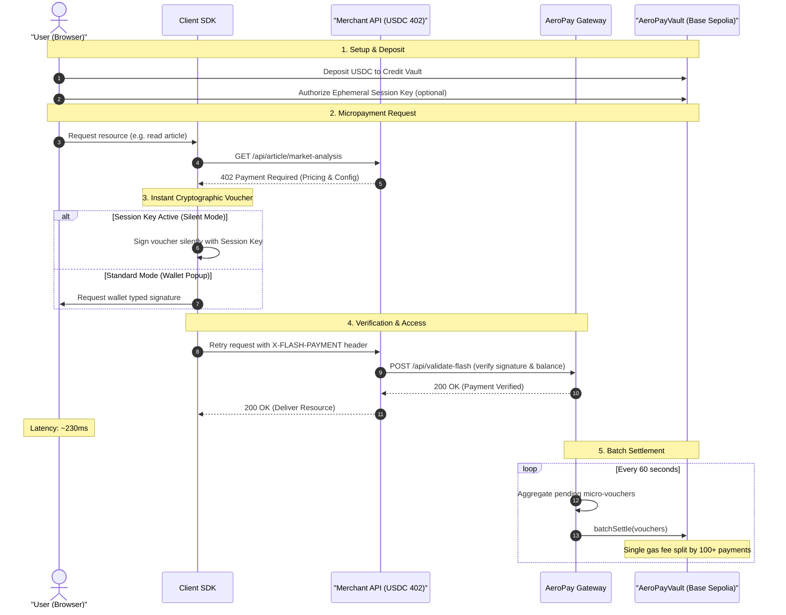

# AeroPay — Low-Latency Layer-2 Micropayment Protocol & SDK

AeroPay is a high-performance Web3 infrastructure protocol built on Base Sepolia. It enables sub-second, gas-optimized micropayments for AI APIs, media streaming, paywalls, and SaaS applications. 

By leveraging off-chain cryptographic EIP-712 micro-vouchers and aggregated on-chain batch settlements, AeroPay bypasses block confirmation latency and saves up to 99% in transaction gas fees compared to standard ERC-20 transfers.

---

## Core Architecture & Features

AeroPay introduces a new economic primitive for the decentralized web: **instant, granular pay-per-request monetization** with frictionless UX.



### Key Technical Achievements
*   **Sub-second Payment Latency (~230ms):** Bypasses L2 block confirmation queues by validating signatures off-chain on local gateway servers.
*   **Batch-Settled Gas Savings (~99%):** Aggregates hundreds of micropayments and submits a single bulk transaction on Base Sepolia.
*   **Silent Session Keys (Frictionless UX):** Users authorize a monthly spend limit once. Subsequent requests are signed silently by an ephemeral hot key stored in the browser—no wallet popups on every click.
*   **Developer-First SDK & Middleware:** Integrate paywalls into Express backends with a simple `flashOr402` middleware decorator.

> [!NOTE]
> **Latency Note (Testnet RPC Limitations):**
> When running on the Base Sepolia Testnet, public RPC endpoints (e.g., `thirdweb.com`) may experience high latency or 5,000ms timeouts when querying vault balances or session key registries on-chain. This cumulative timeout can temporarily bloat local API response times.
>
> In a **production deployment**, this is avoided entirely by:
> 1. Using a dedicated private RPC provider (e.g., Alchemy, QuickNode, Infura) which reduces on-chain query latency to **20ms–50ms**.
> 2. Implementing a gateway **caching layer** (e.g., Redis) to track active session keys and credit lane balances, bypassing RPC requests for routine payment vouchers.

---

## Project Repository Structure

This monorepo contains the following components:

```text
├── contracts/                  # Solidity Smart Contracts (Foundry)
│   ├── src/                    # Credit Vault & Merchant Registry code
│   └── test/                   # Comprehensive unit & fuzz tests
├── gateway/                    # Node.js/Express Orchestration Gateway
│   ├── src/services/           # EIP-712 Verification & Risk Engine
│   └── data/                   # Local database tracking nonces & metrics
├── packages/                   
│   ├── client-sdk/             # TypeScript client SDK (`@flash-rail/client-sdk`)
│   └── merchant-middleware/    # Express middleware (`@flash-rail/merchant-middleware`)
└── demos/                      
    ├── Premium-news-api/       # Back-end API serving paywalled content
    └── newsletter-client/      # Rebranded "Daily Flash" premium news frontend
```

---

## Installation & Development Setup

### Prerequisites
*   [Node.js](https://nodejs.org/) (v18 or newer)
*   [Foundry](https://book.getfoundry.sh/getting-started/installation) (for compiling/testing smart contracts)

### 1. Build SDK Packages
Run the builds to compile local workspaces:
```bash
# Compile and build client-sdk
cd packages/client-sdk
npm install
npm run build

# Compile and build merchant-middleware
cd ../merchant-middleware
npm install
npm run build
```

### 2. Compile and Test Smart Contracts
Navigate to the `contracts/` directory to compile Solidity files and run tests:
```bash
cd ../../contracts
forge compile
forge test
```
*Note: Contract verification structures use the on-chain registry name `FlashCreditVault` to remain compatible with the live contract deployed on Base Sepolia.*

---

## Running the AeroPay Stack Locally

To experience the low-latency payment flow in action, you can start the Gateway, News API, and Newsletter Demo frontend locally:

### Step 1: Run the Gateway Backend
```bash
cd gateway
npm install
npm run dev
```
Runs on `http://localhost:3000`. Monitors user credit, eligibility, and batches settlements.

### Step 2: Start the paywalled Premium News API
```bash
cd demos/Premium-news-api
npm install
npm run dev
```
Runs on `http://localhost:3002`. Exposes articles that require a valid payment voucher.

### Step 3: Run the AeroPay Main Portal
```bash
cd frontend
npm install
npm run dev
```
Runs on `http://localhost:5173`. Contains the User Dashboard (for depositing USDC and managing session keys), Merchant Portal, and Telemetry Analytics.

### Step 4: Run the Newsletter Demo
```bash
cd demos/newsletter-client
npm install
npm run dev
```
Runs on `http://localhost:5174`. Open this page to test the paywall. You can compare **Popup Mode** (requires wallet authorization) with **Silent Session Key Mode** (automatically unlocks content instantly).

---

## Developer Integration Guide

### 1. Client-Side (Making paid calls)
Use the client SDK to fetch protected resources. If the endpoint responds with `402 Payment Required`, the SDK automatically handles signing and retries.

```typescript
import { FlashRailClient } from "@flash-rail/client-sdk";
import { BrowserProvider } from "ethers";

const provider = new BrowserProvider(window.ethereum);
const signer = await provider.getSigner();

const client = new FlashRailClient({
  gatewayUrl: "http://localhost:3000",
  signer,
  chainId: 84532, // Base Sepolia
  vaultAddress: "0x94fB1E81b912e11fD2718e261EA39810C80c7471",
});

// Fetches paywalled content; signs silently if session key is active
const response = await client.fetch("http://localhost:3002/api/article/market-analysis");

console.log(response.data.content); // "The x402 payment standard represents..."
console.log(`Unlocked in ${response.latency}ms via ${response.method}`); // "Unlocked in 230ms via FLASH"
```

### 2. Server-Side (Protecting API routes)
Protect routes in your Node/Express server using the `flashOr402` middleware:

```typescript
import express from 'express';
import { flashOr402 } from '@flash-rail/merchant-middleware';

const app = express();

const MERCHANT_CONFIG = {
  merchantAddress: '0xBf150DFD114350F37f5967cA859Fb0366133CABf',
  settlementAddress: '0xBf150DFD114350F37f5967cA859Fb0366133CABf',
  token: '0x036CbD53842c5426634e7929541eC2318f3dCF7e', // USDC Base Sepolia
  chainId: 84532,
  price: 100000, // 0.10 USDC (6 decimals)
  gatewayUrl: 'http://localhost:3000',
  description: 'Premium News Article Access',
};

app.get('/api/article/:id', flashOr402(MERCHANT_CONFIG, async (req, res) => {
  // Access is automatically granted if AeroPay payment header is validated
  res.json({
    content: "This is premium, paid content verified instantly off-chain!"
  });
}));
```

---

## Security & Verification Details

*   **Non-custodial Credit Lanes:** Funds deposited in the smart contract vault remain yours. The gateway only locks/reserves the required amount during active payment sessions.
*   **Cryptographic Replay Protection:** Each micro-voucher is signed with a unique user nonce and timestamp-based deadline, validated instantly by the gateway to prevent double-spending.
*   **On-chain Validation:** During batch settlement, the smart contract validates that the vouchers were signed either by the vault owner or an active delegated session key, executing transfers safely on-chain.
